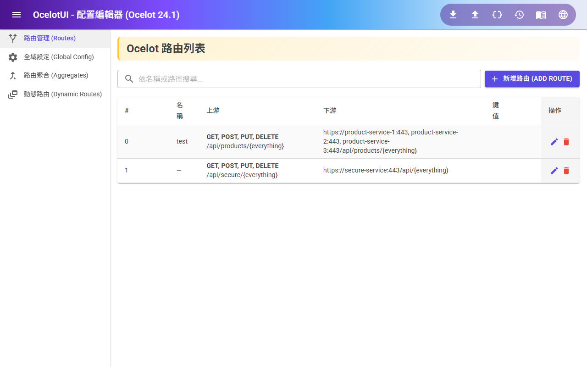
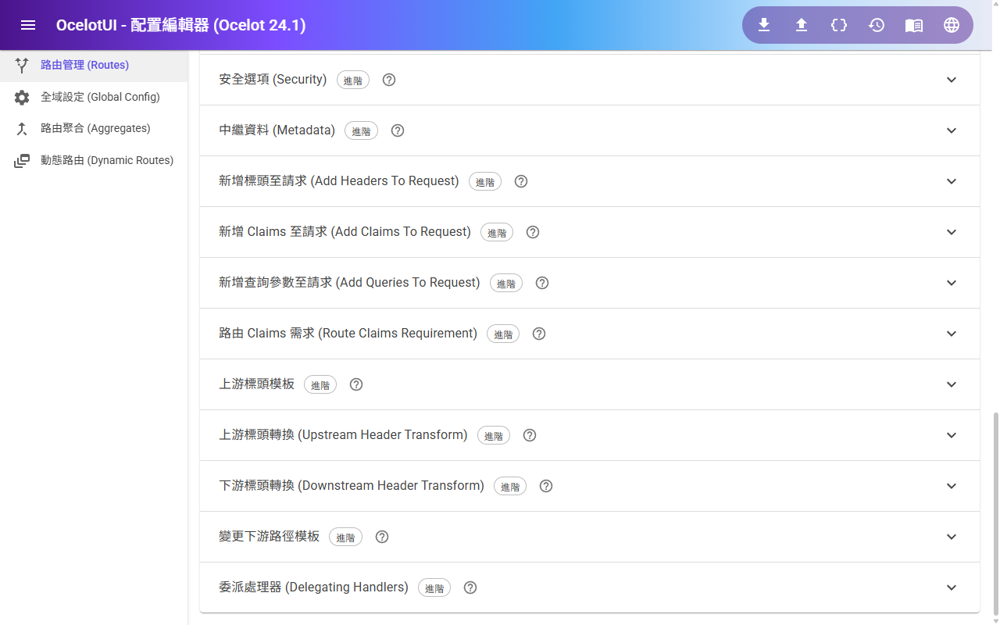
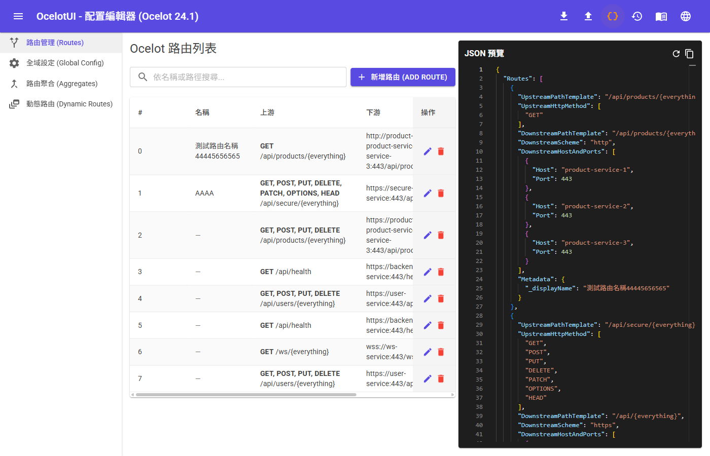
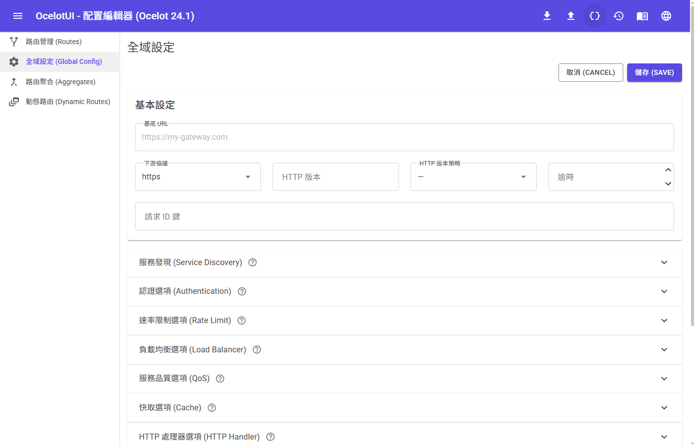
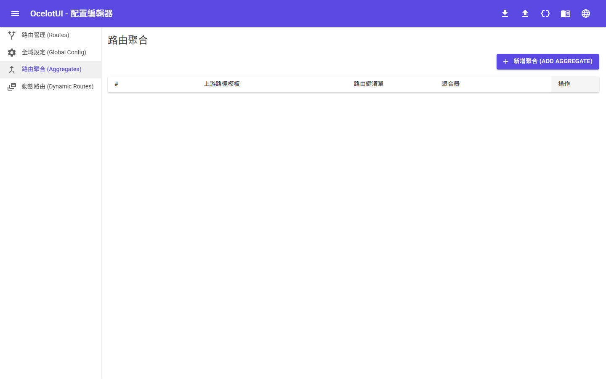
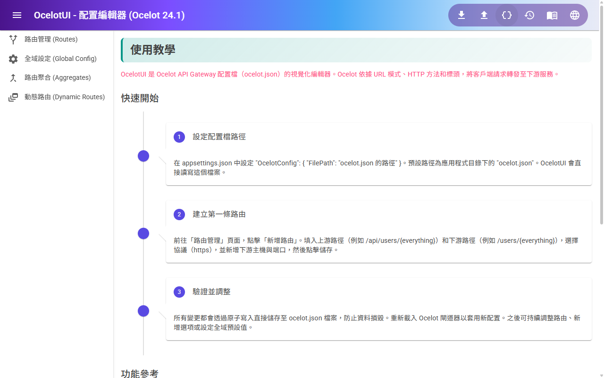
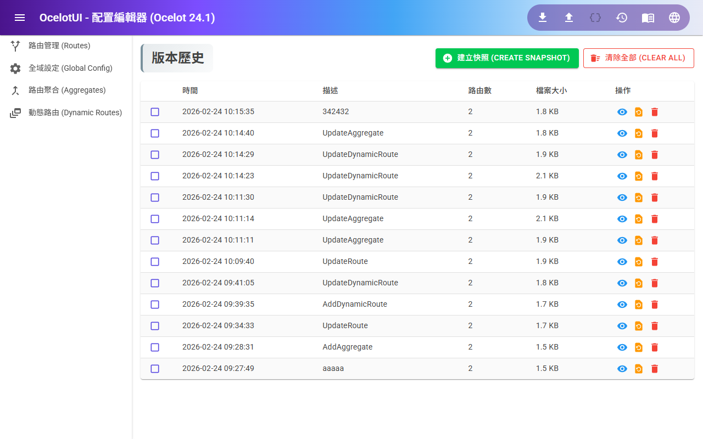
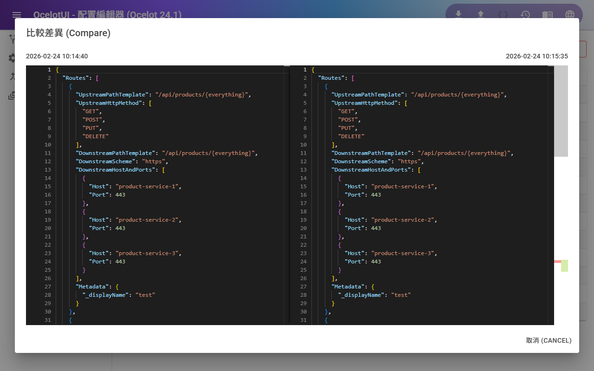

# OcelotUI

[Ocelot](https://github.com/ThreeMammals/Ocelot) API Gateway 設定檔的視覺化編輯器。以 Blazor Server 與 MudBlazor 打造，讓你不需要手動編輯 JSON 就能管理 `ocelot.json`。

> **對應版本：** 本工具的設定結構對應 [Ocelot **24.1**](https://ocelot.readthedocs.io/en/latest/)，涵蓋其所有路由、聚合、動態路由及全域設定屬性。

## 功能特色

- **路由管理** — 以完整表單新增、編輯、刪除、搜尋路由，涵蓋 Ocelot 所有路由屬性
- **全域設定** — 編輯 BaseUrl、下游協定、逾時等全域選項及所有子屬性
- **聚合路由** — 管理回應聚合（Aggregate）設定
- **動態路由** — 設定動態路由規則
- **強型別子屬性編輯器** — 認證、速率限制、負載均衡、QoS、快取、HTTP Handler、安全性、服務探索、Metadata 各有獨立的專屬編輯器
- **路由範本** — 套用內建範本（基本代理、認證路由、速率限制等）快速上手
- **即時 JSON 預覽** — 編輯時同步顯示最終產出的 `ocelot.json` 內容
- **驗證提示** — 自動偵測常見設定錯誤（缺少下游主機、速率限制設定不完整等）並顯示警告
- **情境說明** — 每個欄位均有 tooltip 說明；每個區塊面板提供直連至 Ocelot 官方文件的連結
- **多語系 (i18n)** — 支援英文與繁體中文介面切換
- **原子寫入** — 透過暫存檔 + rename 的方式寫入設定，避免寫入中斷造成檔案損毀
- **版本歷史** — 每次儲存自動建立快照，支援手動建立、預覽、還原、刪除，以及兩筆快照的 side-by-side JSON 差異比對
- **匯出/匯入** — 匯出目前的 `ocelot.json` 或匯入外部配置檔

## 截圖

**路由列表** — 搜尋、新增、編輯、刪除路由



**路由編輯器** — 上游/下游設定、HTTP 方法切換、多主機管理


**子屬性選項** — 認證、速率限制、負載均衡、QoS、快取等可展開面板



**即時 JSON 預覽** — 側欄即時顯示最終的 `ocelot.json` 內容



**全域設定** — 編輯 BaseUrl、下游協定及全域預設值



**聚合路由** — 管理回應聚合設定



**動態路由** — 設定動態路由規則


**使用教學** — 內建快速開始指引與功能參考



**版本歷史** — 瀏覽快照列表，手動建立、預覽、還原、刪除



**差異比對** — 選取兩筆快照進行 side-by-side JSON 差異比較



## 技術棧

| 層級 | 技術 |
|------|------|
| 執行環境 | .NET 10、C# 13 |
| UI 框架 | Blazor Server (InteractiveServer) |
| 元件庫 | MudBlazor 8.x |
| 架構 | Clean Architecture + CQRS (MediatR) |
| 程式碼編輯器 | BlazorMonaco (Monaco Editor) |
| JSON 序列化 | System.Text.Json |
| 資料持久化 | 純檔案 I/O（無資料庫） |

## 快速開始

### 前置需求

- [.NET 10 SDK](https://dotnet.microsoft.com/download/dotnet/10.0)

### 執行

```bash
git clone https://github.com/<your-username>/OcelotUI.git
cd OcelotUI
dotnet run --project src/Web
```

啟動後開啟瀏覽器前往 `https://localhost:53993`。

如需自訂埠號：

```bash
dotnet run --project src/Web --urls http://localhost:5001
```

### 指定 `ocelot.json` 路徑

預設讀寫工作目錄下的 `ocelot.json`。可在 `src/Web/appsettings.json` 中覆寫路徑：

```json
{
  "OcelotConfig": {
    "FilePath": "C:/path/to/your/ocelot.json"
  }
}
```

若指定路徑的檔案不存在，OcelotUI 會在首次儲存時自動建立空白設定檔。

## 專案結構

```
OcelotUI/
├── src/
│   ├── Domain/           # Ocelot 設定的純 POCO（無外部依賴）
│   ├── Application/      # CQRS 處理器（MediatR）
│   ├── Infrastructure/   # 檔案 I/O Repository
│   └── Web/              # Blazor Server UI（MudBlazor）
│       └── Components/
│           ├── Pages/    # Routes、Aggregates、DynamicRoutes、GlobalConfig、History、Guide
│           └── Shared/   # 可重用的子屬性編輯器元件
└── OcelotUI.slnx
```

## 頁面導覽

| URL | 說明 |
|-----|------|
| `/` 或 `/routes` | 路由列表（含搜尋） |
| `/routes/new` | 新增路由 |
| `/routes/edit/{index}` | 編輯路由 |
| `/aggregates` | 聚合路由列表 |
| `/aggregates/new` | 新增聚合路由 |
| `/aggregates/edit/{index}` | 編輯聚合路由 |
| `/dynamic-routes` | 動態路由列表 |
| `/global-config` | 編輯 Ocelot 全域設定 |
| `/history` | 版本歷史（快照管理與差異比對） |
| `/guide` | 內建使用說明 |

## 建置

```bash
dotnet build
```

專案啟用 `TreatWarningsAsErrors`，所有警告均視為建置錯誤。MudBlazor 的 MUD0002 分析器要求元件上的 HTML 屬性必須小寫。

## 貢獻

歡迎送出 Pull Request。較大的功能變更請先開 Issue 討論。

## 授權

MIT
